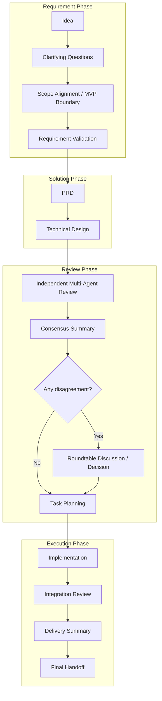

# AegisFlow

[English](./README.md) | [简体中文](./README_zh.md)

AegisFlow is a multi-agent CLI orchestrator that turns an idea into a structured delivery flow: requirement intake, PRD, technical design, independent review, roundtable decision-making, task planning, development, and integration review.

## What It Does

- Guides idea intake and asks only the minimum follow-up questions needed to scope a realistic MVP.
- Produces requirement artifacts such as `idea-brief.md`, `requirement-pack.md`, and validation reviews before PRD generation.
- Generates `prd.md` and `design.md` in the current workspace.
- Runs independent multi-agent reviews, summarizes consensus, and starts a roundtable when reviewers disagree.
- Supports pausing after design or continuing into development in single-terminal or multi-terminal mode.
- Creates implementation plans, per-task execution logs, integration review notes, delivery summaries, and a final handoff.
- Persists session state so the same run can be resumed later with the same `session-id`.

## Requirements

- Node.js 18 or newer
- One or more supported agent CLIs available in your `PATH`

Supported engine detection currently covers `codex`, `claude`, and `gemini` / `gemini-cli`.

## Install

```bash
npm install -g aegisflow
```

After installation, you can start it with:

```bash
aegis
```

An alias is also available:

```bash
aegisflow
```

## Usage

```bash
aegis
aegis --sessions
aegis --setup
aegis <session-id>
aegis <session-id> --from <stage>
aegis -h
aegis --help
aegis -v
aegis --version
aeigs
aegisflow
```

- `aegis`: start a new run in the current directory.
- `aegis --sessions`: list saved sessions, including the project path and last known stage.
- `aegis <session-id>`: resume or continue a specific session.
- `aegis <session-id> --from <stage>`: restart from a specific stage, clearing artifacts for that stage and everything after it before rerunning.
- `aegis --setup`: rerun interactive setup and engine detection.
- `aegis -h` / `aegis --help`: show CLI help and output locations.
- `aegis -v` / `aegis --version`: print the installed version.
- `aeigs` and `aegisflow`: aliases of `aegis`.

Common `--from` values:

- `stage0` / `idea`
- `stage0.5` / `requirement-gate`
- `stage1` / `prd`
- `stage2` / `tech-design`
- `stage3` / `reviews`
- `stage4` / `roundtable`
- `stage4.5` / `strategy`
- `stage5` / `task-plan`
- `stage6` / `execution`
- `stage7` / `integration`

Examples:

```bash
aegis --sessions
aegis demo-session --from stage6
aegis demo-session --from execution
aegis demo-session --from strategy
```

Default session IDs now use the last two workspace directory names plus a timestamp, for example `xiaobei-aegis-flow-2026-03-17T03-29-28-379Z`.

Interactive commands:

- At the first prompt, `/reviewp @prd.md` reviews an existing local PRD file directly instead of starting the full Stage 0-7 pipeline.
- At the first prompt, `/reviewd @design.md` reviews an existing local technical design file directly instead of starting the full Stage 0-7 pipeline.
- The `@` reference accepts relative or absolute paths. If the path contains spaces, use `/reviewp @"docs/my prd.md"` or `/reviewd @"docs/my design.md"`.
- After the review finishes, the current workspace gets `prd-review.md` and `prd-revised.md` for direct user inspection.
- After `/reviewd` finishes, the current workspace gets `design-review.md` and `design-revised.md` for direct user inspection.

## Workflow

1. Idea intake and requirement gate
2. PRD drafting
3. Technical design drafting
4. Independent reviews and consensus summary
5. Optional roundtable for conflicting design decisions
6. Development strategy selection
7. Task planning and execution
8. Integration review and final handoff

## Workflow Diagram



## Output Layout

Only the final workspace deliverables are written into the current working directory:

- `prd.md`
- `design.md`

Session metadata and archived artifacts are stored under `~/.aegisflow/sessions/<session-id>/`.

Common archived files include:

- `idea-brief.md`
- `requirement-pack.md`
- `consensus-report.md`
- `roundtable-minutes.md`
- `implementation-plan.md`
- `integration-review.md`
- `delivery-summary.md`
- `final-handoff.md`

Per-task execution records are stored under `~/.aegisflow/sessions/<session-id>/archive/task-runs/`.

## Setup And Configuration

On first run, AegisFlow guides you through setup and creates a global config file at `~/.aegisflow/config.json`.

- Use `--setup` any time you want to redetect engines or change routing preferences.
- A sample config is provided in `aegisflow.config.json.example`.
- Model execution timeout is configurable via `timeouts.modelExecutionMinutes` in `~/.aegisflow/config.json` and defaults to `30`.
- Environment variable overrides are available for common settings such as `AEGISFLOW_LANGUAGE`, `AEGISFLOW_DESIGN_LEAD`, `AEGISFLOW_FALLBACK_ORDER`, `AEGISFLOW_CODEX_CMD`, `AEGISFLOW_CLAUDE_CMD`, `AEGISFLOW_GEMINI_CMD`, and the matching `*_ARGS` variables.

## Local Development

```bash
npm install
npm run dev
npm run build
npm run release:check
```

## Publish

Before publishing, make sure the package name is available on npm and then run:

```bash
npm publish
```

If you publish through GitHub Actions:

1. Add an `NPM_TOKEN` repository secret.
2. Bump the version in `package.json`.
3. Update `CHANGELOG.md`.
4. Push a tag like `v1.0.1`.
