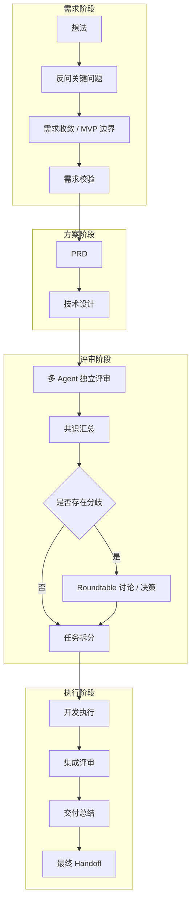

# AegisFlow

[English](./README.md) | [简体中文](./README_zh.md)

AegisFlow 是一个多智能体 CLI 编排工具，可以把一个想法推进成完整交付链路：需求整理、PRD、技术设计、独立评审、圆桌决策、任务拆分、开发执行和集成评审。

## 它能做什么

- 引导用户完成想法整理，只追问最少但必要的补充问题，帮助收敛出可执行的 MVP。
- 在进入 PRD 之前生成结构化需求产物，例如 `idea-brief.md`、`requirement-pack.md` 和需求校验结果。
- 在当前工作目录生成 `prd.md` 和 `design.md`。
- 组织多 Agent 独立评审，汇总共识，并在出现分歧时自动进入圆桌讨论。
- 支持在设计完成后暂停，或者继续进入开发；开发阶段既支持单终端，也支持多终端协作。
- 生成任务计划、逐任务执行记录、集成评审、交付总结和最终 handoff。
- 持久化会话状态，后续可以通过同一个 `session-id` 继续执行。

## 环境要求

- Node.js 18 或更高版本
- `PATH` 中可用的一个或多个受支持的 Agent CLI

当前会自动检测 `codex`、`claude`、`gemini` / `gemini-cli`。

## 安装

```bash
npm install -g aegisflow
```

安装完成后，可以使用以下命令启动：

```bash
aegis
```

也可以使用这个别名：

```bash
aegisflow
```

## 使用方式

```bash
aegis
aegis --sessions
aegis --setup
aegis <session-id>
aegis <session-id> --from <stage>
aegis -h
aegis --help
aegis -v
aegis --version
aeigs
aegisflow
```

- `aegis`：在当前目录启动一次新的编排流程。
- `aegis --sessions`：列出历史会话，并显示对应项目路径和最近阶段。
- `aegis <session-id>`：恢复或继续某个指定会话。
- `aegis <session-id> --from <stage>`：从指定阶段重新开始，并在重跑前清理该阶段及其后续阶段的产物。
- `aegis --setup`：重新执行初始化和引擎检测。
- `aegis -h` / `aegis --help`：查看命令说明、流程概览和产物位置。
- `aegis -v` / `aegis --version`：查看当前安装版本。
- `aeigs` 和 `aegisflow`：都是 `aegis` 的别名。

常用 `--from` 取值：

- `stage0` / `idea`
- `stage0.5` / `requirement-gate`
- `stage1` / `prd`
- `stage2` / `tech-design`
- `stage3` / `reviews`
- `stage4` / `roundtable`
- `stage4.5` / `strategy`
- `stage5` / `task-plan`
- `stage6` / `execution`
- `stage7` / `integration`

示例：

```bash
aegis --sessions
aegis demo-session --from stage6
aegis demo-session --from execution
aegis demo-session --from strategy
```

默认生成的 `session-id` 现在会带上当前工作目录的最后两级目录名，再拼上时间戳，例如 `xiaobei-aegis-flow-2026-03-17T03-29-28-379Z`。

交互命令：

- 在第一次输入时支持 `/reviewp @prd.md`，会直接评审当前本地已经存在的 PRD 文件，不再进入完整的 0-7 阶段流水线。
- 在第一次输入时支持 `/reviewd @design.md`，会直接评审当前本地已经存在的技术设计文件，不再进入完整的 0-7 阶段流水线。
- `@` 后面支持相对路径或绝对路径；如果路径中有空格，可以写成 `/reviewp @"docs/my prd.md"` 或 `/reviewd @"docs/my design.md"`。
- 评审完成后会在当前目录生成 `prd-review.md` 和 `prd-revised.md`，供用户直接查看。
- `/reviewd` 评审完成后会在当前目录生成 `design-review.md` 和 `design-revised.md`，供用户直接查看。

## 工作流

1. 想法整理与需求闸门
2. PRD 生成
3. 技术设计草稿
4. 独立评审与共识汇总
5. 存在分歧时进入圆桌决策
6. 选择开发推进策略
7. 任务拆分与执行
8. 集成评审与最终交接

## 流程图



## 产物结构

当前工作目录只写入最终交付物：

- `prd.md`
- `design.md`

会话元数据和归档产物会保存在 `~/.aegisflow/sessions/<session-id>/` 下。

常见的归档文件包括：

- `idea-brief.md`
- `requirement-pack.md`
- `consensus-report.md`
- `roundtable-minutes.md`
- `implementation-plan.md`
- `integration-review.md`
- `delivery-summary.md`
- `final-handoff.md`

逐任务执行记录会保存在 `~/.aegisflow/sessions/<session-id>/archive/task-runs/`。

## 初始化与配置

首次运行时，AegisFlow 会引导你完成初始化，并在用户目录下创建全局配置文件 `~/.aegisflow/config.json`。

- 可以通过 `--setup` 重新检测引擎或调整路由偏好。
- 示例配置见 `aegisflow.config.json.example`。
- 模型执行超时可通过 `~/.aegisflow/config.json` 中的 `timeouts.modelExecutionMinutes` 配置，默认值为 `30`。
- 支持通过环境变量覆盖常用设置，例如 `AEGISFLOW_LANGUAGE`、`AEGISFLOW_DESIGN_LEAD`、`AEGISFLOW_FALLBACK_ORDER`、`AEGISFLOW_CODEX_CMD`、`AEGISFLOW_CLAUDE_CMD`、`AEGISFLOW_GEMINI_CMD`，以及对应的 `*_ARGS` 变量。

## 本地开发

```bash
npm install
npm run dev
npm run build
npm run release:check
```

## 发布

发布前，请先确认 npm 上的包名可用，然后执行：

```bash
npm publish
```

如果你通过 GitHub Actions 发布：

1. 添加仓库密钥 `NPM_TOKEN`。
2. 更新 `package.json` 中的版本号。
3. 更新 `CHANGELOG.md`。
4. 推送类似 `v1.0.1` 这样的 tag。
